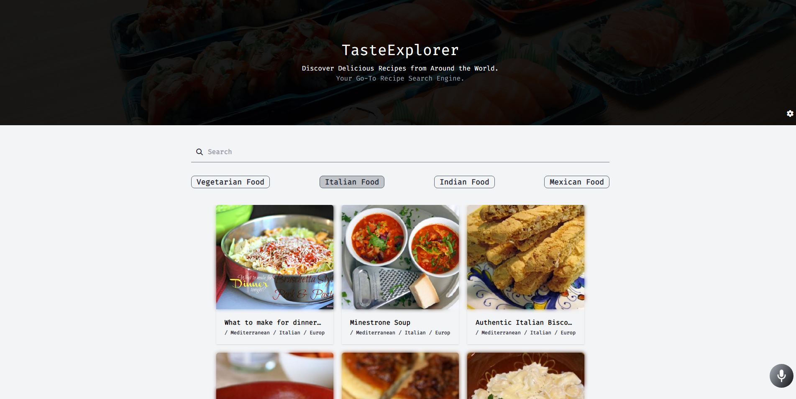

<div align="center">
  
</div>
<h1 align="center">
    TasteExplorer, Recipe Search Engine
</h1>
<p align="center">
   <a href="https://taste-explorer.netlify.app/" target="_blank"> Recipe Search Engine Web App  </a> built with React & TypeScript </a> and hosted with <a href="https://www.netlify.com/" target="_blank">Netlify</a>
</p>
<br />

### Click to <a href="https://taste-explorer.netlify.app/" target="_blank"> Visit </a>

<br />
<br />
<p align="center">
 <a href="https://taste-explorer.netlify.app/" target="_blank">
    
 </a>
</p>

<br />
  <br />
<br />

> The app is designed to help users find a wide range of recipes based on their preferences and dietary needs & also offers voice interactivity as a feature, allowing users to use it hands-free and make their search experience even more convenient.

  <br />

 <br />
<br />

## Built with

```bash

 React

 TypeScript

 Redux tookit

 TailwindCSS

```

  <br />

## Used

```bash
 Vite       React-Router-Dom     Alan AI voice Interactions
```

  <br />

### Fonts

```bash
  Fira Code
```

<br />

## About

> **Fast and reliable access to Recipe & Details.** <br> **Advanced data handling and customization with Redux toolkit.** <br> **Provided Voice AI to interact with website just by using your voice** <br> **Include the ability to be responsive to all screen sizes.**

<br />
<br />
 
 
 <div align="center">
  
  <h6> Designed & Built By <a href="https://github.com/sumyat-aung/">Su Myat Aung</a></h1>
</div>
